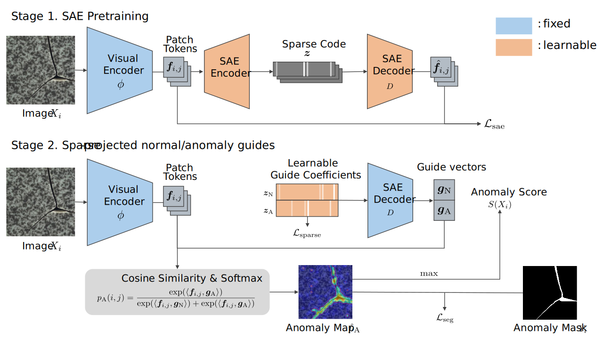

# SPG: Sparse-Projected Guides with Sparse Autoencoders for Zero-Shot Anomaly Detection

<p align="center">
  <a href="https://arxiv.org/abs/2604.02871">
    
  </a>
  
  
  
</p>

This repository contains the official implementation of **SPG (Sparse-Projected Guides)**, a prompt-free framework for cross-dataset zero-shot anomaly detection and segmentation.

SPG uses frozen foundation-model image features and learns sparse guide coefficients on a labeled auxiliary dataset. The learned coefficients are projected through a sparse autoencoder (SAE) dictionary to construct normal/anomaly guide vectors, enabling transfer to unseen target categories without training or fine-tuning on the target dataset.

The current release focuses on cross-dataset experiments between **MVTec AD** and **VisA**.

<p align="center">
  
</p>

## ✨ Highlights

- Prompt-free zero-shot anomaly detection and segmentation.
- Frozen visual backbones with SAE-based sparse guide vectors.
- Cross-dataset evaluation: train on MVTec AD and evaluate on VisA, and vice versa.
- Pixel-level anomaly segmentation with atom-level inspection of high-coefficient anomaly-guide atoms.
- Hydra-based configuration for training, evaluation, and ablation scripts.

## 📦 Repository Layout

```text
.
├── assets/                    # README figures and visual assets
├── run.py                     # Main Hydra entry point
├── scripts/
│   ├── env.sh                 # REPO_ROOT, DATASET_ROOT, CACHE_DIR, PYTHONPATH
│   ├── setup_dataset.sh       # Generate dataset meta.json files
│   ├── run.sh                 # Full MVTec/VisA reproduction entry point
│   └── ablation*.sh           # Ablation scripts
├── configs/
│   ├── main.yaml
│   ├── data/                  # Dataset configs
│   ├── experiment/guide_sae.yaml
│   ├── mode/                  # train, train_sae, eval
│   ├── model/                 # Backbone configs
│   └── sae/
├── src/
│   ├── analysis_sae/          # SAE atom visualization and inspection
│   ├── cache/
│   ├── data/
│   ├── encoders/
│   ├── modules/sae/
│   ├── pipelines/
│   └── runners/
├── requirements.txt
└── outputs/                   # Training/evaluation outputs
```

## 🛠️ Environment Setup

The reproduction scripts assume that commands are executed from the repository root.

Recommended environment:

- Python 3.11 or 3.12.
- NVIDIA GPU with CUDA support. The default reproduction setting uses a DINOv3 ViT-L/16 backbone at image size 448 and is intended for GPU execution.
- Sufficient disk space for MVTec AD, VisA, downloaded backbone weights, feature caches, and experiment outputs.

```bash
cd ${REPO_ROOT}
python -m venv .venv
source .venv/bin/activate
pip install -r requirements.txt
```

The default environment variables are defined in `scripts/env.sh`.

```bash
source scripts/env.sh
```

By default, datasets are expected under `${REPO_ROOT}/../datasets`, and feature caches are written to `${HOME}/.cache/features`. Edit `DATASET_ROOT` and `CACHE_DIR` in `scripts/env.sh` to match your environment, or export them before running the scripts.

`CACHE_DIR` has priority over the Hydra `cache.dir` value. If `CACHE_DIR` is not set, the default cache path is `${HOME}/.cache/features`.

### Backbone Weights

Backbone weights are downloaded by the corresponding encoder implementation on first use. The default backbone, `facebook/dinov3-vitl16-pretrain-lvd1689m`, is loaded through Hugging Face Transformers.

Before running the default DINOv3 experiments, request and accept access to the model on Hugging Face:

- <https://huggingface.co/facebook/dinov3-vitl16-pretrain-lvd1689m>

The model page requires you to log in and agree to share your contact information before the files can be accessed. After approval, make sure your environment can authenticate to Hugging Face, for example with `huggingface-cli login`, before launching the scripts.

## 🗂️ Dataset Preparation

Download the datasets from their official sources:

- MVTec AD: <https://www.mvtec.com/research-teaching/datasets/mvtec-ad>
- VisA: <https://github.com/amazon-science/spot-diff>

MVTec AD is distributed under CC BY-NC-SA 4.0, and the VisA dataset is distributed under CC BY 4.0. Check the dataset pages for the full license terms.

Place MVTec AD and the 1-class VisA layout as follows:

```text
${DATASET_ROOT}/
├── mvtec_anomaly_detection/
│   └── <category>/
│       ├── train/
│       ├── test/
│       └── ground_truth/
└── visa/
    ├── split_csv/
    │   └── 1cls.csv
    └── ...
```

The dataset loader requires a `meta.json` file in each dataset root. Generate these metadata files before running training or evaluation:

```bash
cd ${REPO_ROOT}
bash scripts/setup_dataset.sh
```

The script sources `scripts/env.sh` and uses `DATASET_ROOT`. To use a different dataset parent directory for one run:

```bash
DATASET_ROOT=/path/to/datasets bash scripts/setup_dataset.sh
```

The commands above create:

```text
${DATASET_ROOT}/
├── mvtec_anomaly_detection/
│   ├── meta.json
│   └── <category>/
│       ├── train/
│       ├── test/
│       └── ground_truth/
└── visa/
    ├── meta.json
    ├── split_csv/
    │   └── 1cls.csv
    └── ...
```

The dataset configs are:

- `data=single_dataset/mvtec`
- `data=single_dataset/visa`

If your datasets are stored elsewhere, edit `DATASET_ROOT` in `scripts/env.sh` or export it before running the setup, training, and evaluation scripts.

You can also generate metadata directly with Python:

```bash
python src/generate_dataset_json/mvtec.py --root /path/to/mvtec_anomaly_detection
python src/generate_dataset_json/visa.py --root /path/to/visa
```

If `DATASET_ROOT` is set, it takes priority over `--root` and the dataset subdirectory is resolved automatically (`mvtec_anomaly_detection` for MVTec AD, `visa` for VisA).

## 🚀 Reproducing the Main Experiments

After creating and activating the virtual environment, run:

```bash
cd ${REPO_ROOT}
bash scripts/run.sh
```

This runs the following cross-dataset experiments:

1. Train SAE on MVTec AD.
2. Train guide vectors on MVTec AD using the trained SAE checkpoint.
3. Evaluate on VisA.
4. Train SAE on VisA.
5. Train guide vectors on VisA using the trained SAE checkpoint.
6. Evaluate on MVTec AD.

The default reproduction setting uses:

- Backbone: `facebook_dinov3-vitl16`
- Image size: `448`
- SAE epochs: `50`
- SAE hidden dimension: `4096`
- SAE TopK: `32`
- Guide training epochs: `15`
- Evaluation image score: anomaly map max pooling

Outputs are written under:

```text
outputs/YYYY-MM-DD/HH-MM-SS_<method>_<backbone>/
```

Metric CSV files are saved inside each run directory, typically under `metrics/`.

## 🧪 Manual Usage

The main entry point is `run.py`. It supports three modes:

- `mode=train_sae`: train the sparse autoencoder dictionary.
- `mode=train`: train guide vector coefficients.
- `mode=eval`: evaluate a trained guide model.

### 1. Train SAE

```bash
python run.py mode=train_sae \
  model=facebook_dinov3-vitl16 \
  data=single_dataset/mvtec \
  train.epoch=50 \
  model.image_size=448 \
  sae.0.hidden_dim=4096 \
  sae.0.sparsifier_params.topk=32 \
  sae.0.use_cls=false \
  sae.0.input_norm=none \
  save_freq=50
```

### 2. Train guide vectors

Set `model.method_config.guide_sae.datetime` and `checkpoint_epoch` to the SAE run you want to reuse.

```bash
python run.py mode=train \
  model=facebook_dinov3-vitl16 \
  experiment=guide_sae \
  data=single_dataset/mvtec \
  train.epoch=15 \
  model.image_size=448 \
  save_freq=1 \
  train.learning_rate=0.01 \
  train.ema.warmup_steps=0 \
  model.method_config.sae.0.hidden_dim=4096 \
  model.method_config.sae.0.auxk=512 \
  model.method_config.sae.0.use_cls=false \
  model.method_config.sae.0.input_norm=none \
  model.method_config.sae.0.sparsifier_params.topk=32 \
  model.method_config.guide_sae.datetime=YYYY-MM-DD/HH-MM-SS \
  model.method_config.guide_sae.checkpoint_epoch=50
```

`experiment=guide_sae` is required for SPG training. Without it, the default `model.method` remains `none`.

### 3. Evaluate

```bash
python run.py mode=eval \
  data@test_data=single_dataset/visa \
  train_dir=outputs/YYYY-MM-DD/HH-MM-SS_guide_sae_facebook_dinov3-vitl16 \
  evaluate.epoch=15 \
  evaluate.use_ema=true \
  evaluate.image_score.mode=map \
  evaluate.image_score.map_pool=max \
  evaluate.pro_use_fast=true
```

## 🧩 Supported Backbones in This Release

Backbone configs currently included under `configs/model/`:

- `facebook_dinov3-vitl16`
- `facebook_dinov2-large`
- `google_siglip-large-patch16-384`
- `ViT-L_14@336px`

The default reproduction script uses DINOv3 ViT-L/16.

## 🔍 SAE Atom Inspection

SPG guide coefficients can be inspected at the atom level. For the usual single-atom visualization workflow, specify an SAE checkpoint:

```bash
CKPT=outputs/YYYY-MM-DD/HH-MM-SS_none_facebook_dinov3-vitl16/checkpoints/epoch_50.pth \
scripts/vis_atom.sh
```

The script sources `scripts/env.sh`, so `DATASET_ROOT`, `CACHE_DIR`, and `PYTHONPATH` are set automatically. `sae_atom_overlays.py` resolves the dataset root from `DATASET` and `DATASET_ROOT` (`mvtec` -> `mvtec_anomaly_detection`, `visa` -> `visa`).

Common overrides can be passed as environment variables:

```bash
DATASET=visa \
ATOM_IDS="3351 120 42" \
CKPT=outputs/YYYY-MM-DD/HH-MM-SS_none_facebook_dinov3-vitl16/checkpoints/epoch_50.pth \
scripts/vis_atom.sh
```

Other useful overrides are `HIDDEN_DIM`, `TOPK`, `INPUT_NORM`, `OUTPUT_DIR`, and `SAE_DATASET_ROOT` (only when you need to override the auto-resolved dataset root). For direct Python usage and batch modes, see:

```bash
python -m src.analysis_sae.sae_atom_overlays individual --help
python -m src.analysis_sae.sae_atom_overlays batch_dino --help
python -m src.analysis_sae.sae_atom_overlays batch_siglip --help
```

## ⚙️ Configuration Notes

- Hydra configs are stored in `configs/`.
- Python-side config dataclasses are stored in `src/configs/`.
- `configs/experiment/guide_sae.yaml` defines the parameters for the training guide vectors.
- `configs/mode/train_sae.yaml`, `configs/mode/train.yaml`, and `configs/mode/eval.yaml` define mode-specific defaults.
- `scripts/env.sh` sets the default dataset root, cache directory, and Python path.
- `scripts/setup_dataset.sh` generates `meta.json` files for MVTec AD and VisA.

Important SPG parameters include:

- `model.method_config.guide_sae.datetime`
- `model.method_config.guide_sae.checkpoint_epoch`
- `model.method_config.guide_sae.guide_topk`
- `model.method_config.guide_sae.detection_aggregation`
- `model.method_config.sae.0.hidden_dim`
- `model.method_config.sae.0.sparsifier_params.topk`

## 🧯 Troubleshooting

- **Dataset not found**: check `DATASET_ROOT` in `scripts/env.sh` and confirm that `mvtec_anomaly_detection/` and `visa/` exist.
- **SAE checkpoint not found during guide training**: confirm that `model.method_config.guide_sae.datetime` matches the SAE output directory date/time and that `checkpoint_epoch` exists.
- **SAE atom inspection fails immediately**: pass `CKPT=...` to `scripts/vis_atom.sh` and confirm the checkpoint file exists.
- **CUDA out of memory**: reduce `train.batch_size` or `model.image_size`.
- **Hydra config error**: run commands from the repository root and pass `experiment=guide_sae` when training guide vectors.

## 🙏 Acknowledgements

Parts of the CLIP/OpenCLIP encoder utilities were adapted from [mlfoundations/open_clip](https://github.com/mlfoundations/open_clip) and [zqhang/AnomalyCLIP](https://github.com/zqhang/AnomalyCLIP). We thank the authors and contributors for making their implementations available.

## 📚 Citation

If you use this code, please cite:

```bibtex
@misc{nanaumi2026spgsparseprojectedguidessparse,
  title={SPG: Sparse-Projected Guides with Sparse Autoencoders for Zero-Shot Anomaly Detection},
  author={Tomoyasu Nanaumi and Yukino Tsuzuki and Junichi Okubo and Junichiro Fujii and Takayoshi Yamashita},
  year={2026},
  eprint={2604.02871},
  archivePrefix={arXiv},
  primaryClass={cs.CV},
  url={https://arxiv.org/abs/2604.02871},
}
```

Please also cite the original papers for the foundation-model backbones used in your experiments.
